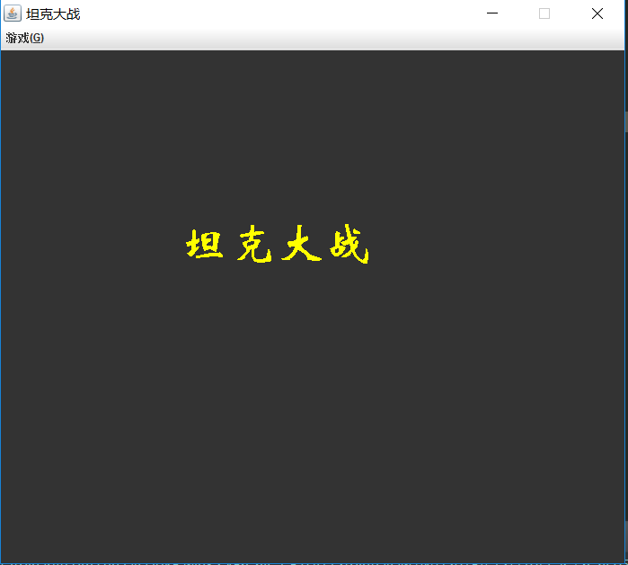

# TankGame
## JAVA坦克大战
## 概要
使用JAVA编写一个人机游戏，玩家有1辆坦克（有3条命），计算机有多辆坦克，玩家坦克可以通过键盘控制进行移动和发射子弹，敌方坦克自由运动并自动发射子弹，当子弹击中对方坦克时对方坦克死亡，当我方的坦克的命为0时游戏结束，当敌方的所有坦克死亡时进入下一关

## 一、系统简介
使用JAVA编写一个人机版的坦克大战游戏，玩家控制的坦克能够四处移动并且坦克能够打击敌人，敌人坦克也能够任意移动(坦克之间不重叠)，并能被击中摧毁、能够模拟爆炸。该游戏中有一个玩家，拥有一辆坦克，此坦克生命值为3。敌方第一关有3辆坦克，第二关有5辆坦克。玩家坦克在没有进行任何操作的情况下处于无敌状态，当开始移动或者发射子弹的时候无敌状态消失，当被敌方的坦克击中时丧失一条命，按下enter键时可以在原地复活坦克，当玩家的坦克生命为0时游戏结束，当玩家坦克子弹击中敌方坦克时敌方坦克死亡，当敌方的所有坦克死亡时进入第二关，第二关所有敌人坦克死亡时玩家获得游戏胜利。  
需要掌握的知识：JAVA中类、子类、接口的创建与使用方法；了解基本绘图方法、菜单的创建方法；事件监听的实现方法；线程的使用方法等。  
开发工具：JAVA、myeclipse   
目标掌握技术：    
1. JAVA中类、子类、接口的创建与使用方法；  
2. 了解基本绘图方法、菜单的创建方法；
3. 事件监听的实现方法；线程的使用方法等。

## 二、需求分析
利用java语言编写坦克大战游戏，用图形用户界面实现，将游戏的所有元素能够在图形用户界面上展现出来，界面能够显示游戏开始操作，游戏中能显示玩家坦克与敌方坦克的作战现场情况，同时此界面具有人机交互功能，能够接受用户的开始游戏、移动、射击、复活坦克、退出游戏等相关操作。
* 坦克：坦克种类分为两种，即敌方坦克与我方坦克。我方坦克与子弹通过键盘来控制，而敌方坦克在存活的情况下，可随机自由移动，其中子弹也随机发射。而且我方坦克与敌方的移动都在活动范围内，敌方坦克将要触碰边界时随机自动转换方向，并且敌方坦克坦克也不能出现重叠的现象，即两坦克距离过近时，分别改变方向。
* 子弹：子弹也分为玩家坦克子弹和敌方坦克子弹，玩家坦克由玩家控制空格键发射；敌方坦克由敌方坦克随机发射。敌方子弹击中玩家坦克时会有爆炸效果子弹沿直线移动，且超出活动范围时，自动消失。
* 爆炸效果：爆炸效果在坦克被子弹击中时发生，由三张gif图片连续显示组成。
* 方向：坦克与子弹均有四个方向「上—0、下—1、左—2、右—3」，并且子弹的方向由坦克的方向决定。

具体功能：游戏封装在TankGame类中，对象化为图形化窗口界面，有开始面板与我的面板。玩家通过开始面板选择开始游戏操作，游戏开始时，开始面板移除，进入到我的面板，游戏战场界面与相关操作在我的面板上实现。

## 三、系统设计
类UML图设计  
  

## 四、效果图  
  
  
  
  
  
  
